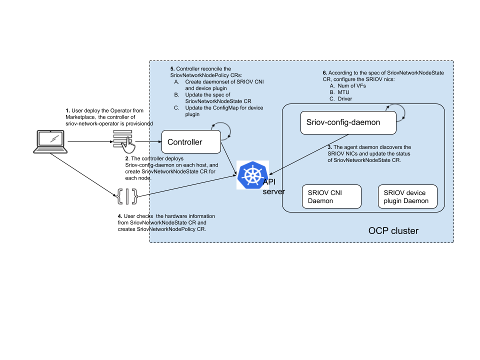

# sriov-network-operator

The Sriov Network Operator is design to help user to provision and configure SR-IOV CNI plugin and Device plugin in Openshift cluster.

## Motivation

SR-IOV network is an optional feature of Openshift cluster. To make it work, it requires different components to be provisioned and configured accordingly. It makes sense to have one operator to coordinate those relevant components in one place, instead of having them managed by different operators. And also, to hide the complexity, we should provide an elegant user interface to simplify the process of enabling SR-IOV.

## Features

- Initialize the supported SR-IOV NIC types on selected nodes.
- provision/upgrade SR-IOV device plugin executable on selected node.  
- provision/upgrade SR-IOV CNI plugin executable on selected nodes.
- manage configuration of SR-IOV device plugin on host.
- generate net-att-def CRs for SR-IOV CNI plugin

## API

The SR-IOV network operator introduces following new CRDs:

- SriovNetwork

- SriovNetworkNodeState

- SriovNetworkNodeConfigPolicy

### SriovNetwork

A custom resource of SriovNetwork could represent the a layer-2 broadcast domain where some SR-IOV devices attach to. It is primarily used to generate the a NetworkAttachmentDefinition CR with SR-IOV CNI plugin configuration. 

This SriovNetwork CR also contains the ‘resourceName’ which is aligned with the ‘resourceName’ of SR-IOV device plugin. One SriovNetwork obj maps to one ‘resoureName’, but one ‘resourceName’ can be shared by different SriovNetwork CRs.

This CR should be managed by cluster admin. Here is an example:

```yaml
apiVersion: sriovnetwork.openshift.io/v1
kind: SriovNetwork
metadata:
  name: example-network
  namespace: example-namespace
spec:
  ipam: |
    {
      "type": "host-local",
      "subnet": "10.56.217.0/24",
      "rangeStart": "10.56.217.171",
      "rangeEnd": "10.56.217.181",
      "routes": [{
        "dst": "0.0.0.0/0"
      }],
      "gateway": "10.56.217.1"
    }
  vlan: 0
  resourceName: intel_nics_1
```

##SriovNetworkNodeState

The custom resource to represent the SR-IOV interface states of each host, which should only be managed by the operator itself.

- The ‘spec’ of this CR represents the desired configuration which should be apply to the interfaces and SR-IOV device plugin.
- The ‘status’ contains current states of those PFs, and the states of the VFs. It helps user to discover SR-IOV network hardware on node.

The spec is rendered by sriov-policy-controller, and consumed by sriov-config-daemon. Sriov-config-daemon is responsible for updating the ‘status’ field to reflect the latest status, this information can be used as input to create SriovNetworkNodeConfigPolicy CR.

An example of SriovNetworkNodeState CR:

```yaml
apiVersion: sriovnetwork.openshift.io/v1
kind: SriovNetworkNodeState
metadata:
  name: worker-node-1
  namespace: sriov-network-operator
spec:
  interfaces:
  - deviceType: vfio-pci
  mtu: 1500
  numVfs: 4
  pciAddress: 0000:86:00.0
status:
  interfaces:
  - deviceID: "1583"
    driver: i40e
    mtu: 1500
    numVfs: 4
    pciAddress: 0000:86:00.0
    maxVfs: 64
    vendor: "8086"
    Vfs:
      - deviceID: 154c
      driver: vfio-pci
      pciAddress: 0000:86:02.0
      vendor: "8086"
      - deviceID: 154c
      driver: vfio-pci
      pciAddress: 0000:86:02.1
      vendor: "8086"
      - deviceID: 154c
      driver: vfio-pci
      pciAddress: 0000:86:02.2
      vendor: "8086"
      - deviceID: 154c
      driver: vfio-pci
      pciAddress: 0000:86:02.3
      vendor: "8086"
  - deviceID: "1583"
    driver: i40e
    mtu: 1500
    pciAddress: 0000:86:00.1
    maxVfs: 64
    vendor: "8086"
```

From this example, in status field, user can find out there are 2 SRIOV capable NICs on node 'work-node-1'; in spec field, user can learn what the expected configure is generated from the combination of SriovNetworkNodeConfigPolicy CRs.

## SriovNetworkNodeConfigPolicy

This CRD is the key of SR-IOV network operator. This custom resource should be managed by cluster admin, to instruct the operator to:

1. Render the spec of SriovNetworkNodeState CR for selected node, to configure the SR-IOV interfaces.
2. Deploy SR-IOV CNI plugin and device plugin on selected node.
3. Generate the configuration of SR-IOV device plugin.

An example of SriovNetworkNodeConfigPolicy CR:

```yaml
apiVersion: sriovnetwork.openshift.io/v1
kind: SriovNetworkNodePolicy
metadata:
  name: policy-1
  namespace: sriov-network-operator
spec:
  deviceType: vfio-pci
  mtu: 1500
  nicSelector:
    deviceID: "1583"
    rootDevices:
    - 0000:86:00.0
    vendor: "8086"
  nodeSelector:
    feature.node.kubernetes.io/sriov-capable: "true"
  numVfs: 4
  priority: 90
  resourceName: intel_nics_1
```

In this example, user selected the nice from vendor '8086' which is intel, device module is '1583' which is XL710 for 40GbE, on nodes labeled with 'sriov-capable' equals 'true'. Then for those PFs, create 4 VFs each, set mtu to 1500 and the load the vfio-pci driver to those virtual functions.

## Components and design

This operator is split into 2 components:

- controller
- sriov-config-daemon

The controller is responsible for:

1. Read the SriovNetworkNodeConfigPolicy CRs and SriovNetwork CRs as input.
2. Render the manifests for SR-IOV CNI plugin and device plugin daemons.
3. Render the spec of SriovNetworkNodeState CR for each node.

The sriov-config-daemon is responsible for:

1. Discover the SRIOV NICs on each node, then sync the status of SriovNetworkNodeState CR.
2. Take the spec of SriovNetworkNodeState CR as input to configure those NICs.

## Workflow


